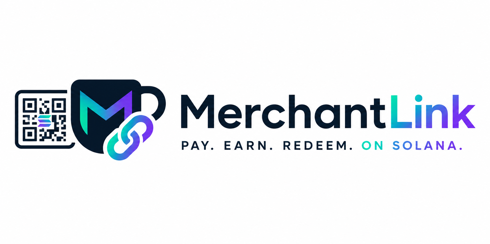

<h1 align="center">MerchantLink</h1>
<p align="center">
  
</p>

<h2>🛍️ MerchantLink</h2>
**A seamless, blockchain-powered Point-of-Sale (POS) backend bridging real-world merchants with Solana-native consumers.**

Built natively on Solana using **Anchor 1.0.2** and the **Token-2022 Program**. MerchantLink empowers retail stores to effortlessly issue on-chain gift cards and soulbound loyalty points, while accepting real-world payments in USDC.

---

## 🌟 The Vision
Traditional POS systems are fragmented, taking massive cuts from gift card sales and making loyalty point tracking a hassle. **MerchantLink** transforms this process by putting the power back into the hands of the merchant and consumer.

By leveraging Solana's high throughput and Token-2022's advanced extension capabilities, we enable a frictionless Web3 retail experience where gift cards act as standard tokens and loyalty points are permanently tied to the consumer's identity.

## 🚀 Key Features

*   💵 **USDC Payments**: Consumers buy gift cards using USDC, which routes instantly and automatically to the merchant's wallet.
*   🎁 **Token-2022 Gift Cards**: Gift cards are minted dynamically as Token-2022 assets. They can be freely traded, gifted, or held in any compatible Solana wallet.
*   🔒 **Soulbound Loyalty Points**: Utilizing Token-2022's `NonTransferable` extension, every gift card purchase rewards the consumer with a loyalty point. These points are mathematically bound to the consumer's wallet and cannot be sold or transferred.
*   🏪 **In-Store Redemption**: Consumers can seamlessly burn their gift cards in-store to pay for real-world goods.
*   ⚡ **Off-Chain Webhooks**: Emits heavily structured Solana events (`GiftCardRedeemed`) that backend servers can listen to in real-time, instantly updating real-world inventory or POS systems.

## 🏗️ Architecture

The backend is built around a streamlined, atomic architecture designed to minimize on-chain bloat while maximizing security.

1.  **`InitializeMerchant`**: The merchant sets up their profile, registering the fixed cost of a gift card. Two mints are automatically deployed via CPI:
    *   A standard Token-2022 mint for **Gift Cards**.
    *   A Token-2022 mint with the **Non-Transferable Extension** for **Loyalty Points**.
2.  **`BuyGiftCard`**: A fully atomic, multi-program transaction. The consumer pays USDC to the merchant's Associated Token Account (ATA). In the exact same transaction, the merchant's PDA mints 1 Gift Card and 1 Soulbound Loyalty Point back to the consumer.
3.  **`RedeemGiftCard`**: The consumer burns their gift card from their wallet. The contract tracks the analytical data and fires a `GiftCardRedeemed` event for the merchant's Web2 server to catch and process the physical world sale.

## 🛠️ Tech Stack
*   **Smart Contracts**: Rust & Anchor framework (`v1.0.2`)
*   **Token Standard**: SPL Token-2022 (`spl-token-2022`)
*   **Local Testing**: LiteSVM (Fast, local Solana validation)
*   **Payments**: SPL Token (USDC standard)

## 🏁 Getting Started

### Prerequisites
*   Rust & Cargo installed
*   Solana CLI (`v1.18+`)
*   Anchor CLI (`v1.0.2`)

### Build
To build the program locally:
```bash
anchor build
```


---
*Built for the Solana Turbin3 Capstone.*
